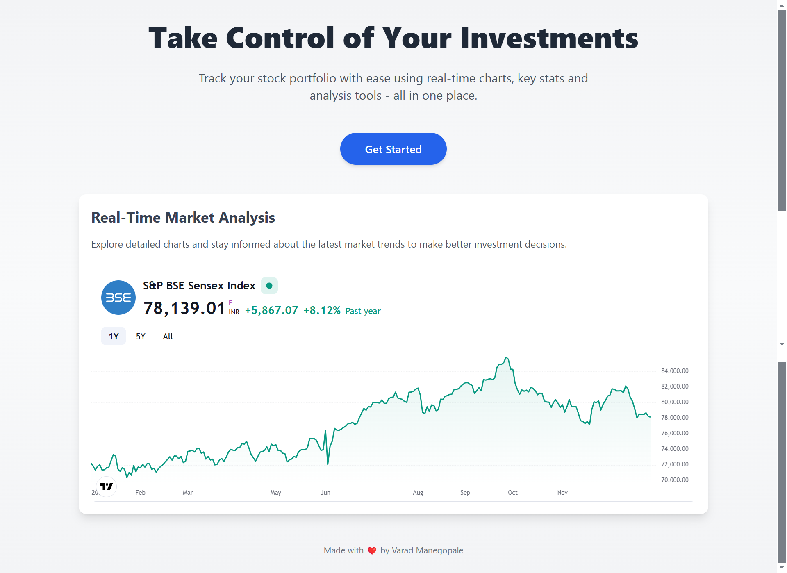
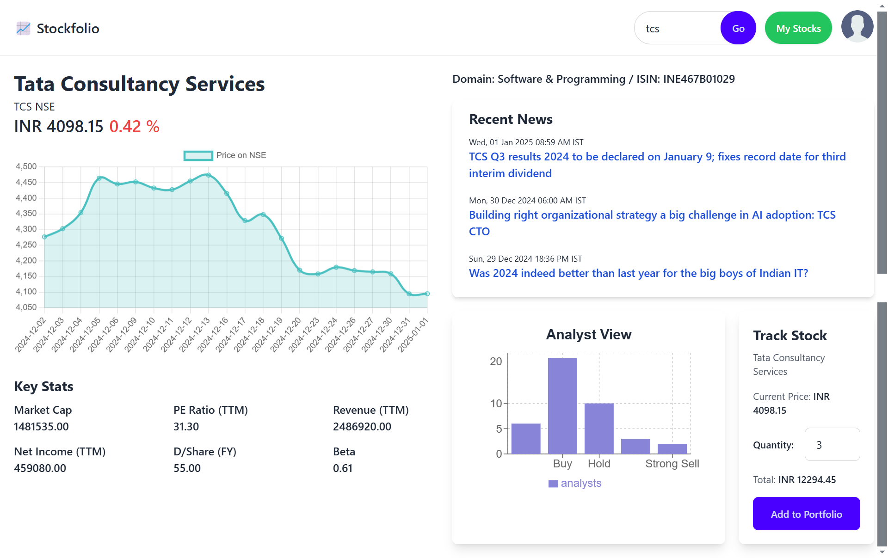
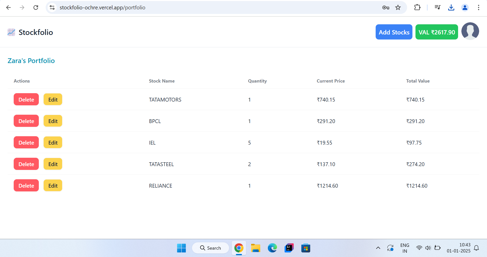
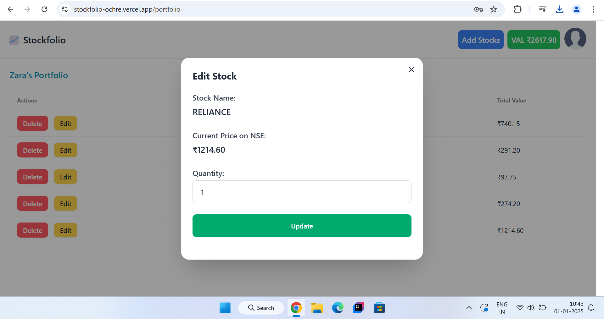
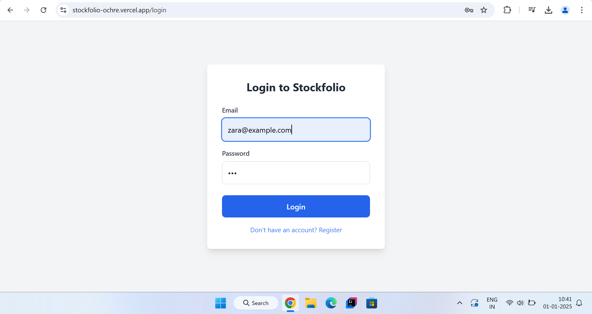

# Stockfolio - A Stock Portfolio Tracker 📊

Stockfolio is a full-stack web application that allows users to track their stock portfolio. It enables users to add, view, edit, and delete stock holdings, calculate the portfolio value based on real-time stock prices, and view key metrics through a responsive and user-friendly interface.

## Features ✨
- **Frontend:**  
  - Built using **React.js** ⚛️ and styled with **Tailwind CSS** 🌸.  
  - A **dashboard** displaying the portfolio's total value and key metrics using **Chart.js** 📉 and **React-ChartJS**.  
  - A **stock search page** with real-time stock data, including key stats, news, and price charts 📈.  
  - Add, edit, and delete stock holdings in the portfolio.  

- **Backend:**  
  - Developed using **Java Spring Boot** ☕, with **JPA** and **MySQL** for database interaction.  
  - Exposes **RESTful APIs** to manage stock data and calculate portfolio value 🔧.  
  - Real-time stock price data integrated using **Rapid API** 🚀.

## Tech Stack 🛠️
- **Frontend:**  
  - React.js ⚛️  
  - Tailwind CSS 
  - Chart.js, Recharts, React-ChartJS 📊  
  - Vercel (for deployment) 🚀  

- **Backend:**  
  - Java Spring Boot ☕  
  - JPA and Hibernate 💾  
  - MySQL 🗄️  
  - Railway.app (for deployment) 🌐  

- **Real-time Data:**  
  - Rapid API 🌍 (for stock prices and news)

## Screenshots 🚀

#### 🏠 Landing Page


--

#### 🔍 Search Stocks


--

#### 📊 Portfolio View


--

#### ✏️ Edit Stock Details


--

#### 🔐 Login Page



## Demo 🎬
You can check out the live application here: https://stockfolio-ochre.vercel.app/

## Installation 🛠️

### Backend Setup:
1. Clone the repository:
  
2. Navigate to the backend folder and install dependencies:
   ```bash
   mvn install
   ```
3. Update the `application.properties` file with your MySQL credentials.
4. Run the backend:
   ```bash
   mvn spring-boot:run
   ```

### Frontend Setup:
1. Clone the repository:
   
2. Navigate to the frontend folder and install dependencies:
   ```bash
   npm install
   ```
3. Run the frontend:
   ```bash
   npm run dev
   ```

## Usage 🖥️
1. Navigate to the live link: https://stockfolio-ochre.vercel.app/
2. Log in using the following demo credentials:
   - **Email:** `zara@example.com`  
   - **Password:** `123`  
3. Use the portfolio management interface to:
   - Add, edit, or delete stocks 📊.
   - View your portfolio’s total value and key metrics 💵.

## Limitations ⚠️
- The backend may be inaccessible on some mobile networks due to free-tier and regional limitations. Please use **Wi-Fi** for access. 🌐  
- **Rapid API** has a limit of 250 requests per month, so excessive use may cause rate-limiting. ⏳
